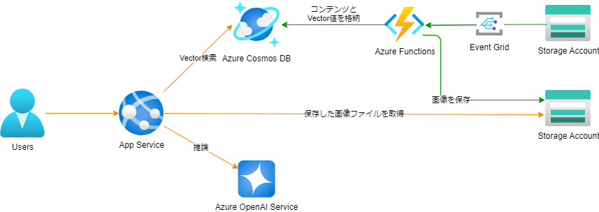
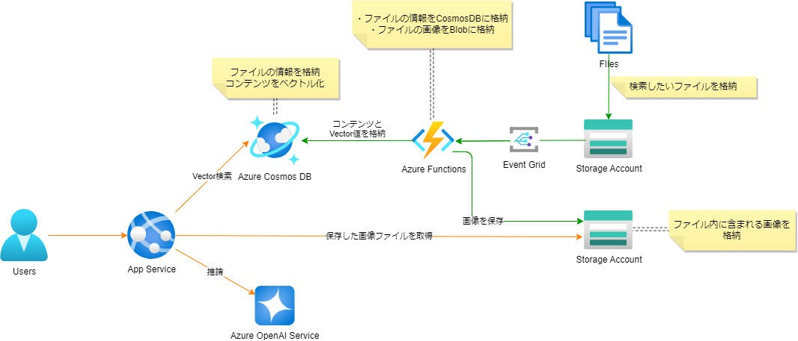

# RAGアーキテクチャ

## 想定するドキュメント
企業内には、ExcelやWordでフリーフォーマットで書かれたドキュメントが多量に存在する。
そのドキュメントに書き方は、テキストによる説明や、表、図など、さまざまである。
それらのフリーフォーマットなドキュメントを検索し推論できるデータにする。

## 想定するデータ形式
- PDFファイル（拡張子：.pdf）
  - ExcelやWordで作成されたドキュメントをPDFに変換したもの
  理由：フリーフォーマットな文書の場合、ドキュメント内のどこからどこまでが重要な情報なのかがわからないため、人が印刷設定を確認しPDF変換したものを対象とする。

## 概要

Azure OpenAI ServiceとAzure CosmosDB for NoSQLを使う構成です。
Microsoft Build 2024にて、CosmosDB for NoSQLにベクトル値を格納しベクトル検索できるようにサービスアップデートされました。
従来は、検索のためにAzure AISearchを使うのが一般的でしたが、AISearchはコストが高く、可用性が高くない課題がありました。
CosmosDBはAISearchと比べ、コストが低く可用性が高いです。ベクトル検索で十分精度が出る場合は、CosmosDBを使うことも一つの選択肢になりました。

構成図はこちらです。




**検索精度向上のために、セマンティック検索やハイブリッド検索を使いたい場合はAISearchを使いましょう。こちらの構成ではファイル内コンテンツはCosmosDBに貯めているため、後からAISearchをアドオンして拡張できます。**

## 各サービスの役割



- 元ドキュメントはBlobStorageに格納します。
- ドキュメントには図や表が含まれることを想定しているので、図や表に含まれる情報で検索できるようにするために、OpenAIのGPT4oを使って画像情報をテキスト化します。
- CosmosDBにドキュメントをテキスト化したデータと、ベクトル値を格納します。
- チャット時に元の画像を使って推論するために、PDFファイルに図が含まれる場合はStorageAccountのBlobコンテナに画像ファイルを格納します。

## リソース設定
./infra/README.md

# 処理概要

## CosmosDBデータ構造

```json
{
    "id": uuid,
    "page_number": ページ番号,
    "content": "ページごとの内容",
    "content_vector": [],
    "keywords": "キーワード1, キーワード2, ...",
    "file_name": "ファイル名",
    "file_path": "ファイルパス",
    "is_contain_image": false,
    "image_blob_path": "画像のBlobパス",
    "delete_flag": false
}
```
- contentには、GPT4vで生成したテキストを格納する。
- keywordsには、GPT4vで生成したテキストから抽出したキーワードを格納する。
- delete_flagには、削除フラグを格納する。(true/false)
※CosmosDBChangeFeedは削除イベントを検知できないため、削除フラグを設け、削除フラグがtrueの場合は、AISearchから削除しCosmosDBからも削除する。

## Blob → CosmosDB (Blob EventGrid)
EventGridからのトリガーをFunctions(Python)が受け取り、BlobStorageに格納されたPDFファイルを解析し、CosmosDBにコンテンツ情報を格納し、BlobStorageに画像ファイルを格納します。
1. PDFファイルを1ページずつ読み込む
2. ページごとにGPT4oを使用し、テキストを生成する
3. 画像が含まれる場合、ページを画像ファイルにしてBlobStorageに格納する
4. 2.で生成したテキストをOpenAIのembeddingモデルでベクトル化する
5. 生成したテキストとベクトル値、画像ファイルのBlobパスをCosmosDBに格納する

## チャットアプリの検索～推論までの処理の流れ
1. チャットメッセージをベクトル化する
2. CosmosDBにベクトル検索する　※仮閾値：0.85
3. 検索した結果に対し、is_contain_imageがtrueの場合、BlobStorageから画像を取得する
4. 2と3のテキストと画像を使いGPT4oで推論する