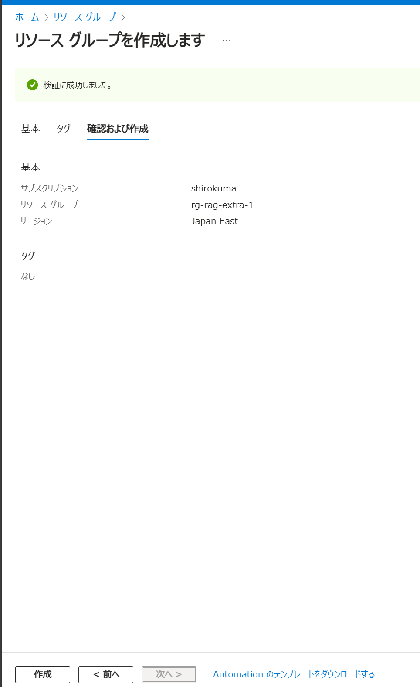
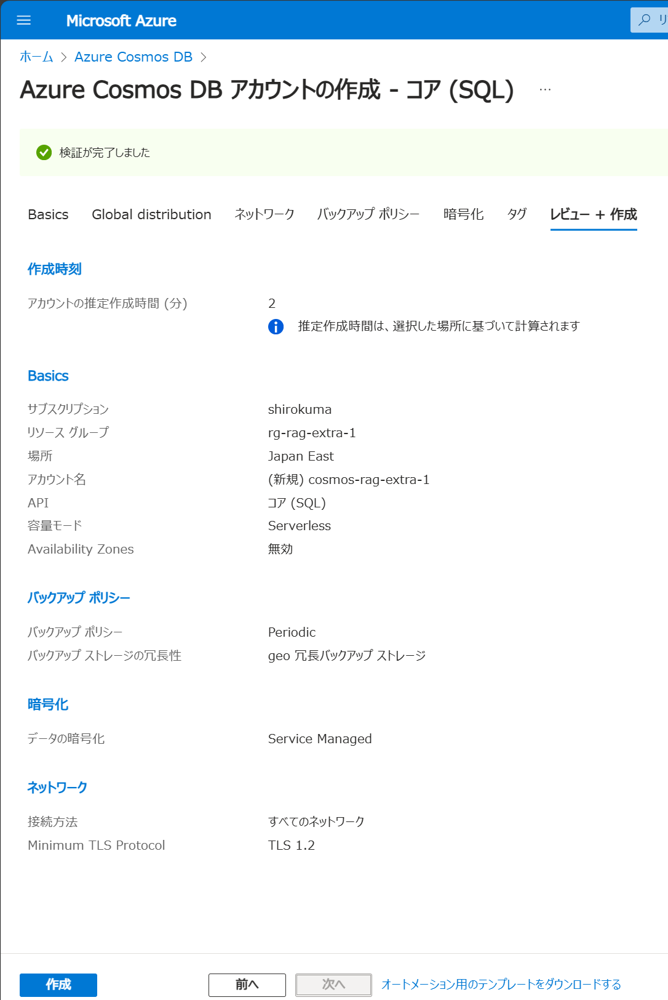
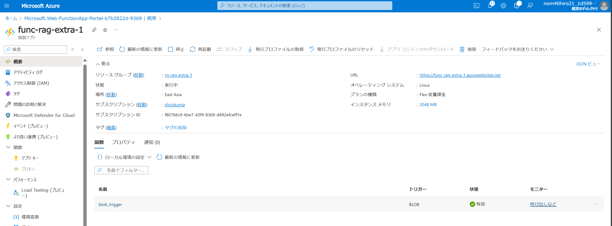

## リソース設定

払い出しが必要なリソースはこれらです。
- ResourceGroup
- VNet, Subnet
- StorageAccount
- CosmosDB for NoSQL
- OpenAI Service
- Azure Functions（ローカルでコードを動かせるためオプション）
- WebApps（ローカルでコードを動かせるためオプション）

Azure Portalから払い出す手順

### ResourceGroup




### VNet, Subnet


### StorageAccount

サブスクリプションで、EventGridのリソースプロバイダーを登録


データ保護、暗号化、タグはデフォルトのまま


作成したStorageAccountに二つのコンテナを作成
- rag-docs
- rag-images


### CosmosDB for NoSQL

コア（SQL）で作成


以降の設定はすべてデフォルト



CosmosDB for NoSQLのベクトル機能を有効化


DatabaseとContainerを作成
ベクトル検索のためのベクターポリシーとベクトルインデックスポリシーを設定
ベクトルポリシーのJson
```json
{
    "vectorEmbeddings": [
        {
            "path": "/content_vector",
            "dataType": "float32",
            "dimensions": 1536,
            "distanceFunction": "cosine"
        }
    ]
}
```

ベクトルインデックスポリシーのJson
```json
{
    "indexingMode": "consistent",
    "automatic": true,
    "includedPaths": [
        {
            "path": "/*"
        }
    ],
    "excludedPaths": [
        {
            "path": "/\"_etag\"/?"
        }
    ],
    "vectorIndexes": [
        {
            "path": "/content_vector",
            "type": "quantizedFlat"
        }
    ]
}
```


### OpenAI Service
AOAIのアクセスリクエスト
https://customervoice.microsoft.com/Pages/ResponsePage.aspx?id=v4j5cvGGr0GRqy180BHbR7en2Ais5pxKtso_Pz4b1_xUNTZBNzRKNlVQSFhZMU9aV09EVzYxWFdORCQlQCN0PWcu

GPT4oが使えるリージョン


インターネットとタグはデフォルト設定


AIStudioで作成したAzureOpenAIServiceのリソースを選択
https://ai.azure.com/


デプロイ画面から「デプロイの作成」


GPT4oモデルを払い出し


embeddingモデルを払い出し


### Azure Functions


ネットワーク、監視、デプロイ、タグ設定はデフォルトのまま


環境変数を設定

高度な編集


以下を追加設定
```json
  {
    "name": "BLOBTRIGGER_CONNECTION",
    "value": "PDFファイルを格納するBlobStorageの接続文字列",
    "slotSetting": false
  },
  {
    "name": "BLOB_CONNECTION",
    "value": "PDFファイル内の画像PNGファイルを格納するBlobStorageの接続文字列",
    "slotSetting": false
  },
  {
    "name": "AZURE_OPENAI_ENDPOINT",
    "value": "AzureOpenAIServiceのエンドポイント",
    "slotSetting": false
  },
  {
    "name": "AZURE_OPENAI_API_KEY",
    "value": "AzureOpenAIServiceのAPIキー",
    "slotSetting": false
  },
  {
    "name": "COSMOSDB_URI",
    "value": "https://cosmos-rag-extra-1.documents.azure.com:443/",
    "slotSetting": false
  },
  {
    "name": "COSMOSDB_KEY",
    "value": "CosmosDBのプライマリキー",
    "slotSetting": false
  },
  {
    "name": "COSMOSDB_DATABASE_NAME",
    "value": "doc-db",
    "slotSetting": false
  },
  {
    "name": "COSMOSDB_CONTAINER_NAME",
    "value": "doc-container",
    "slotSetting": false
  },
  {
    "name": "COSMOS_CONNECTION",
    "value": "CosmosDBの接続文字列",
    "slotSetting": false
  }
```


#### Azure Functionsにデプロイする

前提
VSCodeにAzureAccountとAzureFunctionsの拡張機能がインストールされていること

1. AzureFunctionsの拡張機能をクリック
2. AzureFunctionsのアイコンをクリック
3. Deploy to Azureをクリック

4. 対象のサブスクリプションを選択し、デプロイ先のFunctionsを選択

5. デプロイ確認のメッセージがでるので、Deployクリック


デプロイが完了したら、AzurePortalでログを確認しながら稼働確認

1. StorageAccountのdoc-containerにPDFファイルをアップロード

2. AzureFunctionsのログを確認

### StorageAccountのEventGrid設定

イベントサブスクリプションを作成
```bash
https://<関数アプリ名>.azurewebsites.net/runtime/webhooks/blobs?functionName=Host.Functions.<関数名>&code=<BLOB_EXTENSION_KEY>
```


### SWAはOnYourDataと同じだと思うのでスキップします

.env.localに以下を設定
```bash
NEXT_PUBLIC_URL="http://localhost:3000"
AZURE_OPENAI_ENDPOINT="AzureOpenAIServiceのエンドポイント"
AZURE_OPENAI_API_KEY="AzureOpenAIServiceのAPIキー"
AZURE_OPENAI_DEPLOYMENT_ID="gpt-4o"
AZURE_OPENAI_VEC_DEPLOYMENT_ID="text-embedding-ada-002"
COSMOS_CONNECTION_STRING="CosmosDBの接続文字列"
COSMOS_DATABASE_NAME="doc-db"
COSMOS_CONTAINER_NAME="doc-container"
AZURE_STORAGE_ACCOUNT_NAME="saragextra1"
AZURE_STORAGE_ACCOUNT_ACCESS_KEY="StorageAccountのアクセスキー"
AZURE_STORAGE_CONTAINER_NAME="rag-images"
```


## 動作していない場合の調査

| 現象 | 調査 | 対応例 |
| --- | --- | --- |
| BlobTriggerが動作しない | Functionsの環境変数BLOBTRIGGER_CONNECTIONが設定されているか | Functionsの環境変数にBLOBTRIGGER_CONNECTIONを設定 |
| ↑ | Blobへの接続文字列があっているか | BlobTriggerの設定を確認 |
